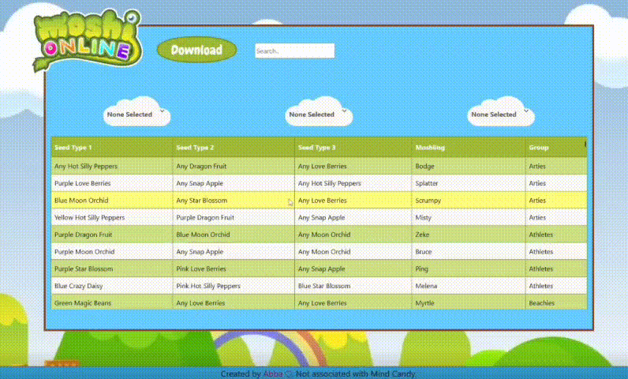

<h1 align="center"> Moshling Garden Search </h1>

Hi there! I made this to help me out in the [Moshi Online🔗](https://moshionline.net/) game (specifically). I have all of the moshling recipes for that game here! 

 </img>

<h2>Features: </h2>
  - You can search any berry, moshling or group using the search bar, the results will populate automatically.  
  - You can use the drop down menu to choose the seeds you have already grown and it will automatically update with your options.  
    (It will display recipes that include any of the three selected seeds. The table will show all results featuring at least one of the chosen seeds. Please note it will not show the "any seed options" unless it exists with a specific selected seed.) 
 
<h2>Bugs:</h2>
  - If you change the drop down menu item from any seed option to "None Selected" it will return an empty table. 
    QUICK FIX: refresh the page using your browser or click the Moshi Online icon in the top left. 
 
<h2>Future Updates:</h2>
  - I will try to add new moshlings as soon as they are released. 
